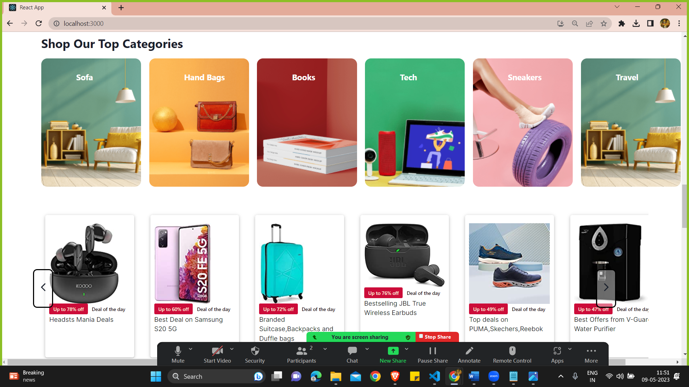

<h1>Ezyshop</h1>

This is a clone of template given to us.

<h3>Live Link: </h3> 

<h3>About the Project:</h3>
Shopcart is a e-commerce website which is made by a group of 5 members in a span of 5 days. The motive of making this was to practice and test our skills that we acquired as of now in Masai School. 

## Features ✨

- User authentication, admin authentication.
- Dynamic Products.
- Filtering, Sorting.
- Create, Read, Update, Delete fucntionalities.
- All the pages are responsive.

## Contributors  😇

- 👤 [Ravi Shukla]
- 👤 [Thilak]
- 👤 [Mohd Asim ]
- 👤 [Akhilesh ]
- 👤 [Rajesh Yadav]

           
<h3>Screenshots:</h3>
 
 
 
 
 

<h3>Technologies Used:</h3>
<ul>
        <li>React</li>
        <li>Chakra UI</li>
        <li>React-Redux</li>
        <li>Firebase</li>
        <li>Reqres</li>
        <li>CSS</li>
</ul>

<h3>Getting Started</h3>
To get started with the project, you can either clone this repository to your local machine:

Or you can fork the repository to your own GitHub account and clone your forked repository.

Once you have the code on your machine, open the project folder in your code editor and start coding.

<h3>Project Structure</h3>

    >my-app
    ├── >src
    │    └── Components
    │    └── images
    │    └── Pages
    │    └── Redux
    │    └── Styling  

